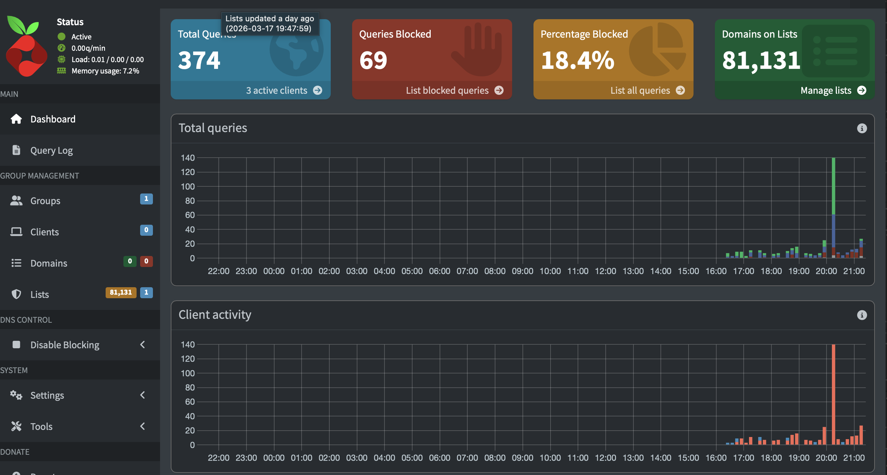

# Project: Hardened DNS Gateway & Network Sinkhole
Objective: Implementing proactive network defense and host-level hardening on a repurposed enterprise grade server.

## Table of Contents
- [Project Overview](#project-overview)
- [Technical Stack](#technical-stack)
- [Security Hardening](#security-hardening)
- [Incident Response](#incident-response)
- [Visual Evidence](#visual-evidence)

## Project Overview
This project involved converting a Dell Latitude E5440 into a dedicated security appliance running Debian 13. The goal was to centralize network traffic through a hardened "chokepoint" to mitigate telemetry, block malicious domains, and reduce the overall digital attack surface of a home network.

## Technical Stack & Skills

| Category | Technology | Skills Demonstrated |
| :--- | :--- | :--- |
| **Hardware** | Dell Latitude E5440 | Resource Management, Legacy Hardware Optimization |
| **OS** | Debian 13 (Headless) | Linux Administration, CLI, System Hardening |
| **Security** | UFW, OpenSSH | Firewall Management, Secure Remote Access |
| **Containerization** | Docker | Service Isolation, Image Management |
| **DNS Defense** | Pi-hole | DNS Sinkholing, Telemetry Mitigation, C2 Blocking |
## Security Implementations
### 1. Host Hardening (SSH)

Modified sshd_config to disable remote root login, mitigating common brute-force attack vectors.

Enforced protocol 2 for improved cryptographic security.

Restricted administrative access to a non-privileged user with sudo permissions.

### 2. Stateful Firewall (UFW)

Implemented a "Default Deny" ingress policy to drop all unsolicited traffic.

Explicitly whitelisted only necessary services:

22/tcp (SSH)

53/udp & 53/tcp (DNS)

80/tcp (Admin Dashboard)

### 3. Service Isolation (Docker)

Virtualized the Pi-hole environment to prevent host-system contamination.

Configured persistence for logs and blocklists to ensure stability during system reboots.

## Incident Response & Troubleshooting
One of the most valuable parts of this project was diagnosing a complete DNS resolution failure across client devices post-deployment.

Symptom: Clients (My MacBook) encountered "Connection Timed Out" when querying the server.

Audit Tools Used: ss -tulpn, docker logs, nslookup, host.

### Findings:

Port Contention: Audited the system for systemd-resolved squatting on Port 53.

Firewall Drop: Confirmed UFW was dropping UDP traffic because rules hadn't been fully reloaded.

Bridge Isolation: Identified that Pi-hole was only listening on the Docker internal bridge (172.x.x.x) and ignoring LAN requests.

Remediation: Updated listening behavior to "Permit all origins" and synchronized UFW rules.

## Project Results & Evidence

### System Resource Monitoring
To ensure the gateway remained lightweight and efficient for legacy hardware, resource usage was monitored using `htop`. The system maintains a minimal footprint while providing network-wide filtering.

### DNS Filtering Dashboard
The Pi-hole dashboard confirms that DNS-level sinkholing is active, successfully blocking telemetry and malicious ad-domains across all connected devices.

## Final Results
Privacy: Successfully blocked thousands of background telemetry requests from OS and smart-device services.

Security: Implemented automated blocklists that update weekly with known phishing and Malware C2 domains.

Efficiency: Observed a significant reduction in network-wide data usage by preventing ad-heavy content from loading at the DNS level.
